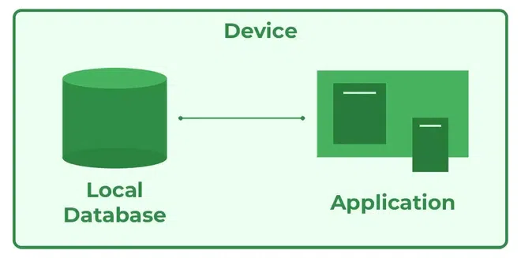

# 1. 3-Tier Architecture
  
## *Overview:*
The 3-tier architecture is a commonly used architectural approach in Database Management Systems (DBMSs) for the design and development of applications that work with databases. It divides an application’s components into three tiers or layers, each with its own set of responsibilities.

## **DBMS 3-Tier Architecture:**
DBMS 3-tier architecture divides the complete system into three inter-related but independent modules:

.jpg)

### 1. **Physical Level:**
   - At the physical level, information about the location of database objects in the data store is kept.
   - Users are unaware of the locations of these objects.
   - Describes how data is stored in secondary storage devices and provides insights into additional storage details.   

### 2. **Conceptual Level:**
   - At the conceptual level, data is represented in the form of various database tables.
   - Users are unaware of the storage details; it's represented as logical schema.
   - Describes what kind of data is to be stored in the database.

### 3. **External Level:**
   - Specifies a view of the data in terms of conceptual level tables.
   - Each external level view caters to the needs of a particular category of users.
   - Focuses on data abstraction; different views can be generated for different users.

## *Data Independence:*
Data independence ensures that a change in data at one level should not affect another level.
- **Physical Data Independence:** Changes in the physical location of tables and indexes should not affect the conceptual level or external view of data.
- **Conceptual Data Independence:** Changes in the conceptual schema should not affect the external schema.

## **Phases of Database Design:**

### 1. **Conceptual Design:**
   - Captures requirements using a high-level conceptual data model.
   - Example: The ER model is used for the conceptual design.

### 2. **Logical Design:**
   - Represents data in the form of the relational model.
   - Uses the ER diagram produced in the conceptual design phase.

### 3. **Physical Design:**
   - Implements data in the relational model using commercial DBMS like Oracle, DB2.

**Advantages of DBMS:**
- Minimized redundancy and data inconsistency.
- Simplified Data Access.
- Multiple data views.
- Data Security.
- Concurrent access to data.
- Backup and Recovery mechanism.

**Benefits of 3-Tier Architecture:**
- Scalability.
- Flexibility.
- Security.
  
The 3-tier architecture in DBMS is widely used for modern web applications and enterprise systems due to its scalability, flexibility, and security benefits. It separates the user interface, application processing, and data management into three distinct tiers, improving overall system performance, reliability, and maintainability.

# 2. 1-Tier Architecture

A database stores a significant amount of critical information to access data quickly and securely. Therefore, selecting the correct architecture is crucial for efficient data management. The Database Management System (DBMS) architecture aids users in accomplishing their requests while connecting to the database. The choice of database architecture depends on factors such as the size of the database, the number of users, and relationships between users. There are two types of database models commonly used: logical models and physical models. In the next section, we will explore various types of database architecture.

## Types of DBMS Architecture

There are several types of DBMS architecture used according to usage requirements. The following types of DBMS architecture are discussed:

1. **1-Tier Architecture**
2. **2-Tier Architecture**
3. **3-Tier Architecture**

## 1-Tier Architecture

In 1-Tier Architecture, the database is directly available to the user. The user can sit directly on the DBMS and use it; that is, the client, server, and database are all present on the same machine. For example, when learning SQL, one may set up an SQL server and the database on the local system. This setup enables direct interaction with the relational database and execution of operations. However, the industry typically doesn't use this architecture, opting instead for 2-tier and 3-tier architectures.

### **Advantages of 1-Tier Architecture:**
1. **Simple Architecture:** 1-Tier Architecture is the most straightforward architecture to set up, requiring only a single machine for maintenance.
  
2. **Cost-Effective:** No additional hardware is required for implementing 1-Tier Architecture, making it a cost-effective solution.

3. **Easy to Implement:** 1-Tier Architecture can be easily deployed, making it suitable for small projects.

# 3. 2-Tier Architecture:
- The 2-tier architecture is similar to a basic client-server model. The application at the client end communicates directly with the database on the server side, using APIs like ODBC and JDBC for interaction.
  
- On the server side, responsibilities include providing query processing and transaction management functionalities. On the client side, user interfaces and application programs are run. The client-side application establishes a connection with the server side to communicate with the DBMS.

## Advantages of 2-Tier Architecture:
1. **Easy to Access:**
   - 2-Tier Architecture provides easy access to the database, facilitating fast retrieval of data.

2. **Scalable:**
   - The database can be easily scaled in 2-Tier Architecture by adding clients or upgrading hardware.

3. **Low Cost:**
   - 2-Tier Architecture is cost-effective compared to 3-Tier Architecture and Multi-Tier Architecture.

4. **Easy Deployment:**
   - Deployment is simpler in 2-Tier Architecture compared to 3-Tier Architecture.

5. **Simple:**
   - 2-Tier Architecture is easily understandable and straightforward due to its two-component structure.

# 4. 3-Tier Architecture:
In 3-Tier Architecture, an additional layer exists between the client and the server. The client doesn't communicate directly with the server. Instead, it interacts with an application server, which then communicates with the database system. Query processing and transaction management occur in this intermediate layer, serving as a medium for the exchange of partially processed data between the server and the client. This architecture is commonly used in large web applications.

#### **Advantages of 3-Tier Architecture:**

1. **Enhanced Scalability:**
   - Scalability is improved due to the distributed deployment of application servers.
   - Individual connections need not be made between the client and server.

2. **Data Integrity:**
   - 3-Tier Architecture maintains data integrity.
   - The middle layer between the client and the server helps avoid or remove data corruption.

3. **Security:**
   - 3-Tier Architecture improves security.
   - This model prevents direct interaction of the client with the server, reducing access to unauthorized data.

#### **Disadvantages of 3-Tier Architecture:**

1. **More Complex:**
   - 3-Tier Architecture is more complex compared to 2-Tier Architecture.
   - Communication points are also doubled in 3-Tier Architecture.

2. **Difficult to Interact:**
   - Interaction becomes challenging due to the presence of middle layers in the architecture.